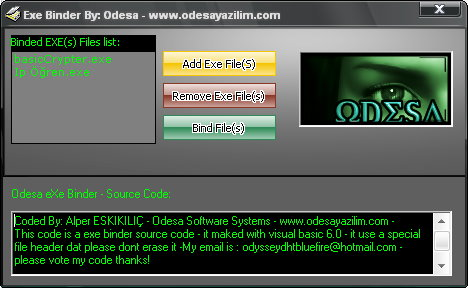



## Odesa Exe Binder

### Description

This code is a basic exe file(S) binder, it can bind a lot of exe files in a few seconds.

Its a very beautiful security program codes.
 
### More Info
 
Private fPaths() As String

Private fIndex As Integer

Private fPoint As Long

he must know or learn basic hexemaninal codes on visual basic.

nothing , it s ready to compile...

             |
---                |---
**Submitted On**   |2008-06-30 11:37:20
**By**             |[Alper ESKIKILI�](https://github.com/Planet-Source-Code/PSCIndex/blob/master/ByAuthor/alper-eskikili.md)
**Level**          |Advanced
**User Rating**    |3.8 (15 globes from 4 users)
**Compatibility**  |VB 5\.0, VB 6\.0
**Category**       |[Complete Applications](https://github.com/Planet-Source-Code/PSCIndex/blob/master/ByCategory/complete-applications__1-27.md)
**World**          |[Visual Basic](https://github.com/Planet-Source-Code/PSCIndex/blob/master/ByWorld/visual-basic.md)
**Archive File**   |[Odesa\_Exe\_2118986302008\.zip](https://github.com/Planet-Source-Code/alper-eskikili-odesa-exe-binder__1-70758/archive/master.zip)

### API Declarations

No api...

